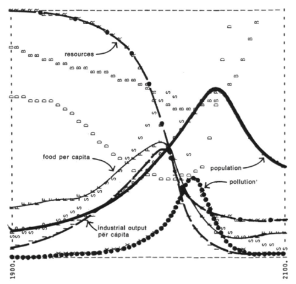

On the 2nd of March 1972, at the Smithsonian Institution in Washington D.C. Dennis Meadows led a symposium which presented the public launch of [_The Limits to Growth_](http://www.donellameadows.org/wp-content/userfiles/Limits-to-Growth-digital-scan-version.pdf). The zeitgeist of the time is captured by Hunter S. Thompson's 1971 ['wave speech'](https://www.goodreads.com/quotes/1074-strange-memories-on-this-nervous-night-in-las-vegas-five) which describes the loss of momentum of the radical and counterculture movements of the 1960s. President Richard Nixon has just returned from an [unprecedented diplomatic visit to China](https://en.wikipedia.org/wiki/Richard_Nixon%27s_1972_visit_to_China), and in Europe, negotiations are in their late stages for the first enlargement of the European Communities [to welcome Denmark, Ireland, and the United Kingdom](https://en.wikipedia.org/wiki/1973_enlargement_of_the_European_Communities). At this time of increased global cooperation, the eyes of the world's press briefly turned towards Meadows et al's dire predictions for the future of global society.

The report detailed the results of a [system dynamics]() model, [World3](), commisioned by the [Club of Rome](https://clubofrome.org/about-us/), and developed by a team of 17 scholars based at the Massachusetts Institute of Technology. The model simulated the interaction and feedback between five subsystems representing global population, capital, agriculture, non-renewable resources, and pollution. Several scenarios were illustrated, starting from the business as usual 'standard run' (reproduced below), through to scenarios where technology and policy is implemented to avert global crises. The authors used these scenarios to illustrate their central argument that unless action is taken to address present growth trends, _"the limits to growth on this planet will be reached sometime within the next one hundred years"_, and _"the most probable result will be a rather sudden and uncontrollable decline in both population and industrial capacity"_ (Meadows et al 1972, p23).

<figure>

 <figcaption>
Reproduction of the 'standard run' from _The Limits to Growth_, 1972 (p124). This scenario assumes no major change in policy takes place. Consequently diminishing resources cause a downturn in industrial growth, which leads to declining food resources and medical supplies and a consequent decline in global population.
 </figcaption>
</figure>

The initial response to the report was largely negative. Economist [Wilfred Beckerman](https://www.ucl.ac.uk/economics/news/2020/apr/remembering-professor-wilfred-beckerman-0) described the report as _"a brazen, impudent piece of nonsense"_ and devoted his inaugral lecture at University College London to attacking it (The Economist, 3 June 1972, p78). A [piece in the New York Times](https://www.nytimes.com/1972/04/02/archives/the-limits-to-growth-a-report-for-the-club-of-romes-project-on-the.html) by several Columbia University economists described it as as _"a rediscovery of the oldest maxim of computer science: Garbage In, Garbage Out"_. [Walter Hecox (1976)](https://lawdigitalcommons.bc.edu/ealr/vol5/iss1/8/) has argued that the decision to release the model results in the accessible format of _'Limits to Growth'_, two years before the [full technical report](https://books.google.co.uk/books?id=qCjKz8S_VKIC) was released diluted its scientific impact. The immediate response then was primarily informed by underlying prejudices rather than a detailed examining of Limits to Growth and the World3 model.

Ugo Bardi claims that criticism of LtG peaked in the 1990s based upon claims that the collapse predicted by the model had failed to materialise ([Bardi 2011](https://www.springer.com/gp/book/9781441994158), p2). In fact, even the 'standard run', presented above, carries through on a smooth trajectory into the first couple of decades of the 21st century. Thus whilst there are genuine criticisms to be made about the model and report, it seems a large portion of this criticism is based upon misrepresentation or misunderstanding.

In the last couple of decades opinion on the study seems to have shifted in a more positive direction, with numerous studies maintaining its validity. This uptake in interest may have been buoyed by the World3 model becoming more widely available through [dissemination on the web](https://metasd.com/2010/04/world3-03/) as well as [free system dynamics software packages](https://vensim.com/free-download/) being available for running it. Numerous studies now exist relating to the discourse surrounding the report and model ([Bardi 2011](https://www.springer.com/gp/book/9781441994158); [Gómez-Baggethun and Naredo 2015](https://link.springer.com/article/10.1007/s11625-015-0308-6?shared-article-renderer); [Eastin et al. 2011](https://papers.ssrn.com/sol3/papers.cfm?abstract_id=1989028)), and more technical aspects surrounding the World3 model itself ([Pasqualino et al. 2015](https://www.mdpi.com/2071-1050/7/8/9864/htm); [Ansell and Cayzer 2018](https://www.sciencedirect.com/science/article/abs/pii/S0301421518303562?via%3Dihub)). With the establishment of the [‘All Party Parliamentary Group on the Limits to Growth’](https://limits2growth.org.uk/) in the UK in 2016, it is clear that Limits to Growth and World3 maintain a clear relevance to contemporary research.

My interest in the Limits to Growth comes first from a modelling perspective, in particular the relevance of the model today and its potential as a base for adaptation. I am also interested in what we can learn from the initial negative reception. Whilst numerous authors have argued that much of the original citicism was based upon misunderstanding and misrepresentation, I believe this can act as a learning point. It is clear that some of this criticism was made in bad faith, but how much did the presentation of the first Limits to Growth report contribute to this outcome? 
