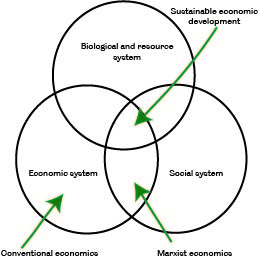

In a [2019 paper](/publication/three-pillars-of-sustainability/), I wrote about the conceptual origins, or lack thereof, of the popular 'three pillars' paradigm of sustainability, comprising of environmental, social, and economic dimensions. Here it was argued that rather than having a single, rigorously conceived origin and underlying theory, this perspective emerged out of the early sustainability literature from twin critiques of the economic status quo from environmental and social perspectives. This is often visualised as a Venn diagram, or more accurately three intersecting circles representing each individual pillar.

Like the three pillars themselves, the origins of this diagram are not popularly known or acknowledged; it is typically taken as a given with little critical consideration to its implied meaning. This diagram appears to have originated initially from Barbier's 1987 paper [_The Concept of Sustainable Economic Development_](https://doi.org/10.1017/S0376892900011449), where it was used to argue that three systems, ecological, economic, and social are integral for consideration in any development process. Here each system is ascribed goals: “genetic diversity, resilience, biological productivity”; “satisfying basic needs (reducing poverty), equity-enhancing, increasing useful goods and services”; and “cultural diversity, institutional sustainability, social justice, participation”, respectively. “The general objective of sustainable economic development, then, is to maximize the goals of all these systems through an adaptive process of trade-offs” (p104). Barbier later describes this diagram as "infamous" [(Barbier 2011)](https://doi.org/10.1111/j.1477-8947.2011.01397.x).

<figure>

 <figcaption>
Reproduction of Barbier's original Venn diagram.
 </figcaption>
</figure>

Whilst this figure is typically described as a Venn diagram, it often lacks the strict logical properties of one. The diagram reproduced below has been [displayed on Wikipedia since 2006](https://en.wikipedia.org/wiki/Sustainability#Three_dimensions_of_sustainability), and labels intersections as 'bearable', 'equitable', and 'viable'. Whilst the Wikipedia article references these to a 2006 report, these intersection labels are absent. So where did they come from, what is the theory behind these labels? The insidious nature of Wikipedia as a source for 'established knowledge' means these terms have seeped into the sustainability literature without any attributed source or meaning (simply Google "viable equitable bearable" for countless examples). In places this is even referenced to Dreo (2006), User:Nojhan, the original contributor in the Wikipedia article. Dreo's [image itself](https://commons.wikimedia.org/wiki/File:Sustainable_development.svg) attributes its source as a translation from an [equivalent diagram present on French Wikipedia](https://commons.wikimedia.org/wiki/File:Developpement_durable.jpg). This translation of _vivable_, _equitable_, and _viable_ [explains why](https://www.collinsdictionary.com/dictionary/french-english/vivable) 'liveable' is often seen in place of 'bearable' in some quarters.

These labels may derive from a 2000 report by Rouxel and Rist [where it appears on the cover](https://www.amazon.fr/d%C3%A9veloppement-durable-m%C3%A9thodologique-diagnostics-territoriaux/dp/B000WVENSW), however I have been unable to obtain a copy of this, and my reliance on translation tools presents a barrier for understanding. Whatever the source of these terms, contemporary use appears to be detached from any underlying theory. Their unsourced, and unelaborated presence on Wikipedia remains problematic in perpetuating this typology.

The 'Venn diagram' is routinely criticised in the literature. In presenting each circle as equal sized, the implication is that each system or set of goals holds equal importance. Not only does this mask underlying ideology, but if we are to subscribe to the 'balancing of trade-offs' description of the pillars, it produces scenarios where only tangibly related economic goals may be pursued at the expense of ecological or social aspects. It is for this reason that an alternate conception of three 'nested' circles may also be seen, emphasising the reliance of systems upon each other. The origins of this diagram too our unclear, although a very early version may be found (again in French) in René Passet's 1979 [L'Économique et le vivant](https://books.google.co.uk/books/about/L_%C3%89conomique_et_le_vivant.html?id=4RFOAQAAIAAJ&redir_esc=y).

The unclear origins of these diagrams, and their mainstreaming within the literature as unsourced and unelaborated is problematic. Whilst often authors provide their own meaning, it is common to see them uncritically accepted and perpetuated without consideration of the underlying ideology behind them. It is important to emphasise sustainability as ideological and the synthesis of mainstream economic discourses into it as a key component should be resisted.
